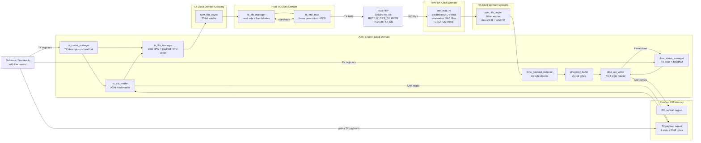

# RMII Ethernet MAC with AXI DMA

This repository contains a small RMII Ethernet subsystem written primarily in VHDL. It has separate receive and transmit datapaths, AXI-Lite control/status registers, AXI4 memory access, and Xilinx XPM asynchronous FIFOs for clock-domain crossing.

The design is intentionally compact and educational: the RX side receives RMII Ethernet frames and writes payloads into memory, while the TX side reads payloads from memory and emits RMII frames.

## Highlights

| Area | Capability |
| --- | --- |
| PHY interface | RMII receive and transmit datapaths using a 50 MHz reference clock |
| RX datapath | Preamble/SFD detection, destination MAC filtering, CRC/FCS checking, payload extraction |
| TX datapath | Descriptor-driven frame scheduling, AXI read bursts, padding for short payloads, CRC/FCS generation |
| Memory access | AXI4 write master for RX payloads, AXI4 read master for TX payloads |
| Register access | AXI4-Lite control/status registers |
| CDC | Xilinx `xpm_fifo_async` bridges between RMII and AXI clock domains |
| Simulation | VHDL RX testbenches and a SystemVerilog TX testbench scaffold |

## Architecture



For the standalone diagram, see [docs/system_block_diagram.md](docs/system_block_diagram.md).

## Repository Layout

```text
src/
  eth_rx.vhd                    RX top level
  rmii_mac_rx.vhd               RMII receive MAC
  eth_rx_dma/                   RX payload collector, AXI writer, status manager
  tx/
    eth_tx.vhd                  TX top level
    tx_status_manager.vhd       TX AXI-Lite descriptor/status registers
    tx_axi_reader.vhd           TX AXI4 read burst engine
    tx_fifo_manager.vhd         TX FIFO writer/read-side handshake manager
    tx_rmii_mac.vhd             RMII transmit MAC

sim/
  tb_rmii_mac_rx.vhd            RMII RX MAC testbench
  tb_eth_rx_new.vhd             RX + DMA testbench
  tx/
    memory_tester.sv            AXI read-only payload memory model
    tb_eth_tx.sv                TX SystemVerilog testbench

docs/
  system_block_diagram.md       Full RX/TX system diagram
  eth_tx_block_diagram.md       TX-specific architecture diagram
  eth_tx_software_interface.md  TX register map and payload memory layout
```

## RX Datapath

The RX path accepts RMII frames, checks whether the destination address matches the local MAC address, validates FCS, and writes payload bytes into AXI memory.

Current RX MAC details:

| Item | Value |
| --- | --- |
| Local destination MAC | `00:11:22:33:44:55` |
| RMII input pins | `i_rxd[1:0]`, `i_crs_dv`, `i_rxer` |
| FIFO entry width | 10 bits |
| FIFO entry payload | `data[7:0]` |
| FIFO entry status | bits `[9:8]` |

RX FIFO status encoding:

| Bits `[9:8]` | Meaning |
| --- | --- |
| `00` | Payload byte |
| `10` | End of valid frame |
| `11` | End of errored/corrupted frame |

After bytes cross into the AXI clock domain, `dma_payload_collector` builds up to 16-byte chunks in a ping-pong buffer. `dma_axi_writer` writes those chunks into memory with AXI4 incrementing bursts.

### RX Software Interface

The RX control/status manager exposes a small AXI-Lite register set.

| Offset | Name | Access | Description |
| --- | --- | --- | --- |
| `0x00` | `RX_PAYLOAD_BASE_ADDR` | W | Base address of the RX payload ring in AXI memory. Writing this enables RX DMA scheduling. |
| `0x04` | `HEAD_ADVANCE` | W | Software writes this register to advance the RX head pointer after consuming one received frame. |
| `0x08` | `HEAD_PTR` | R | Software-owned consumer pointer. Only bits `[1:0]` are used. |
| `0x0C` | `TAIL_PTR` | R | Hardware-owned producer pointer. Only bits `[1:0]` are used. |

The current RX implementation derives the write address as:

```text
rx_payload_address = RX_PAYLOAD_BASE_ADDR + (tail_ptr * 256)
```

Software reads `HEAD_PTR` and `TAIL_PTR` to discover received frames. When `HEAD_PTR != TAIL_PTR`, at least one frame is available. After software consumes the frame at the current head slot, it writes `HEAD_ADVANCE` to release that slot back to hardware.

## TX Datapath

The TX path is descriptor-driven. Software writes payload data into one of four fixed payload slots, writes the descriptor metadata, and advances the tail pointer. Hardware then reads the payload from memory, inserts Ethernet framing fields, computes FCS, and drives RMII `tx_en` / `txd[1:0]`.

Current TX MAC details:

| Item | Value |
| --- | --- |
| Source MAC | `00:11:22:33:44:55` |
| Ethertype | `0x88D5` |
| Minimum payload | 46 bytes, with zero padding when needed |
| Maximum payload | 1500 bytes |
| Payload slot stride | 2048 bytes |
| Descriptor count | 4 |

### TX Payload Memory

```text
PAYLOAD_BASE_ADDR + 0x0000  Entry 0 payload slot, 2048 bytes
PAYLOAD_BASE_ADDR + 0x0800  Entry 1 payload slot, 2048 bytes
PAYLOAD_BASE_ADDR + 0x1000  Entry 2 payload slot, 2048 bytes
PAYLOAD_BASE_ADDR + 0x1800  Entry 3 payload slot, 2048 bytes
```

For a deeper TX memory/register visualization, see [docs/eth_tx_software_interface.md](docs/eth_tx_software_interface.md).

### TX Register Map

| Offset | Name | Access | Description |
| --- | --- | --- | --- |
| `0x00` | `PAYLOAD_BASE_ADDR` | R/W | Base AXI address of the TX payload slot region. |
| `0x04` | `TAIL_PTR` | R/W | Software-owned producer pointer. Software increments this to publish a descriptor. |
| `0x08` | `HEAD_PTR` | R | Hardware-owned completion pointer. Hardware increments this after frame transmission completes. |
| `0x10` | `ENTRY0_DEST_MAC_LOW` | R/W | Destination MAC bits `[31:0]`. |
| `0x14` | `ENTRY0_DEST_MAC_HIGH` | R/W | Destination MAC bits `[47:32]` in bits `[15:0]`. |
| `0x18` | `ENTRY0_PAYLOAD_LENGTH` | R/W | Payload length in bytes. |
| `0x20` | `ENTRY1_DEST_MAC_LOW` | R/W | Entry 1 destination MAC bits `[31:0]`. |
| `0x24` | `ENTRY1_DEST_MAC_HIGH` | R/W | Entry 1 destination MAC bits `[47:32]`. |
| `0x28` | `ENTRY1_PAYLOAD_LENGTH` | R/W | Entry 1 payload length. |
| `0x30` | `ENTRY2_DEST_MAC_LOW` | R/W | Entry 2 destination MAC bits `[31:0]`. |
| `0x34` | `ENTRY2_DEST_MAC_HIGH` | R/W | Entry 2 destination MAC bits `[47:32]`. |
| `0x38` | `ENTRY2_PAYLOAD_LENGTH` | R/W | Entry 2 payload length. |
| `0x40` | `ENTRY3_DEST_MAC_LOW` | R/W | Entry 3 destination MAC bits `[31:0]`. |
| `0x44` | `ENTRY3_DEST_MAC_HIGH` | R/W | Entry 3 destination MAC bits `[47:32]`. |
| `0x48` | `ENTRY3_PAYLOAD_LENGTH` | R/W | Entry 3 payload length. |

## Head / Tail Rings

Both RX and TX use small four-entry rings with 2-bit pointers.

| Direction | Producer | Consumer | Publish action | Release action |
| --- | --- | --- | --- | --- |
| RX | Hardware | Software | Hardware advances `TAIL_PTR` after writing a frame | Software writes `HEAD_ADVANCE` |
| TX | Software | Hardware | Software advances `TAIL_PTR` after preparing a descriptor | Hardware advances `HEAD_PTR` after TX complete |

Pointer interpretation:

| Condition | Meaning |
| --- | --- |
| `HEAD_PTR == TAIL_PTR` | Ring is empty |
| `next(TAIL_PTR) == HEAD_PTR` | Ring is full |
| `HEAD_PTR != TAIL_PTR` | At least one entry is pending or available |

## Clock Domains

| Domain | Used By |
| --- | --- |
| RMII reference clock | `rmii_mac_rx`, `tx_rmii_mac`, TX FIFO read side |
| AXI/system clock | AXI-Lite registers, RX DMA, TX AXI reader, FIFO write/read managers |

The RX and TX datapaths both cross between RMII and AXI clocks through `xpm_fifo_async`.

## XPM Simulation Libraries

The design instantiates Xilinx `xpm_fifo_async`, so simulators need the Xilinx XPM simulation library compiled and mapped.

For Vivado-driven flows, compile simulation libraries for your simulator, for example:

```tcl
compile_simlib \
  -simulator xcelium \
  -language all \
  -library all \
  -dir ./xilinx_simlibs
```

For Questa, use the same idea but target the Questa simulator and make sure the generated `xpm` library is visible in `modelsim.ini` or your library mapping.

## Simulation Notes

The repository currently includes:

| Testbench | Language | Purpose |
| --- | --- | --- |
| `sim/tb_rmii_mac_rx.vhd` | VHDL | Unit-level RMII RX MAC frame parsing |
| `sim/tb_eth_rx_new.vhd` | VHDL | RX top/DMA behavior with AXI-Lite configuration and AXI write checking |
| `sim/tx/tb_eth_tx.sv` | SystemVerilog | TX top testbench scaffold with AXI-Lite writes, AXI read memory model, and RMII TX checking |

The TX testbench is plain SystemVerilog, not UVM. Full TX simulation requires a mixed-language simulator because the DUT is VHDL and the testbench is SystemVerilog.

## Current Status

This is an active work-in-progress hardware project. The major RX and TX building blocks are present, but the top-level integrated NIC wrapper is still a stub:

```text
src/eth_nic.vhd
```

Areas likely to evolve next:

| Area | Expected Direction |
| --- | --- |
| Top-level integration | Combine RX and TX into a single NIC wrapper |
| Software API | Add driver helpers for allocating TX slots and consuming RX slots |
| Register documentation | Keep RX/TX register maps synchronized with RTL |
| Simulation scripts | Add simulator-specific compile/run scripts for Xcelium or Questa |
| Configurability | Make MAC addresses and Ethertype programmable instead of fixed constants |

## License

No license file is currently included. Add one before publishing or reusing this project outside private development.

