# Ethernet TX Architecture

```mermaid
flowchart LR
    subgraph TB["Testbench / System"]
        SW["AXI-Lite test driver<br/>programs TX descriptors"]
        MEM["Payload memory<br/>AXI read-only responder<br/>4 slots x 2048 bytes"]
    end

    subgraph AXI["AXI / System Clock Domain"]
        TOP["eth_tx top"]
        STAT["tx_status_manager<br/>descriptor registers<br/>head / tail scheduling"]
        READER["tx_axi_reader<br/>AXI read burst engine"]
        FIFO_WR["tx_fifo_manager<br/>dest MAC insertion<br/>payload FIFO writer"]
    end

    subgraph CDC["Clock Domain Crossing"]
        AFIFO["xpm_fifo_async<br/>35-bit entries<br/>data[31:0] + valid bytes + last"]
    end

    subgraph RMII["RMII Reference Clock Domain"]
        FIFO_RD["tx_fifo_manager<br/>frame start / finish handshake"]
        MAC["tx_rmii_mac<br/>preamble, SFD, src MAC,<br/>eth type, padding, FCS"]
        PHY["RMII TX pins<br/>tx_en, txd[1:0]"]
    end

    SW -- "AXI-Lite writes<br/>base addr, descriptors, tail ptr" --> TOP
    TOP --> STAT
    STAT -- "schedule request<br/>dest MAC" --> FIFO_WR
    STAT -- "payload address + length" --> READER

    READER -- "AXI4 read address" --> MEM
    MEM -- "AXI4 read data" --> READER
    READER -- "payload FIFO entries" --> FIFO_WR

    FIFO_WR --> AFIFO
    AFIFO --> FIFO_RD
    FIFO_RD -- "FIFO read stream" --> MAC
    FIFO_RD <-- "start / finish toggles" --> MAC
    MAC --> PHY

    classDef tb fill:#eef6ff,stroke:#4b7bec,color:#102a43
    classDef axi fill:#f7f1ff,stroke:#805ad5,color:#24103f
    classDef cdc fill:#fff8e5,stroke:#c27c0e,color:#3b2700
    classDef rmii fill:#eafaf1,stroke:#2f9e44,color:#0b2e13

    class SW,MEM tb
    class TOP,STAT,READER,FIFO_WR axi
    class AFIFO cdc
    class FIFO_RD,MAC,PHY rmii
```



## Data Flow

1. Software or the testbench programs TX descriptor registers over AXI-Lite.
2. `tx_status_manager` watches the descriptor ring tail pointer and schedules pending frames.
3. `tx_axi_reader` fetches the payload from memory using AXI4 read bursts.
4. `tx_fifo_manager` writes destination MAC entries followed by payload entries into the async FIFO.
5. `tx_rmii_mac` reads FIFO entries, emits Ethernet framing fields, pads short payloads, calculates FCS, and drives RMII `tx_en` / `txd[1:0]`.

## FIFO Entry Format

```text
bit  34      : last payload entry
bits 33:32  : valid byte count encoding
bits 31:0   : payload or destination-MAC data
```

