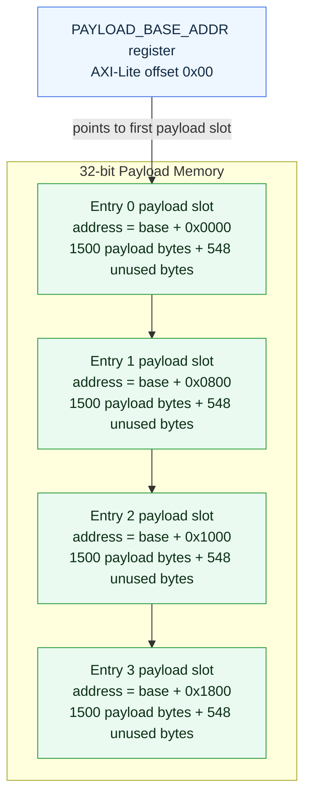
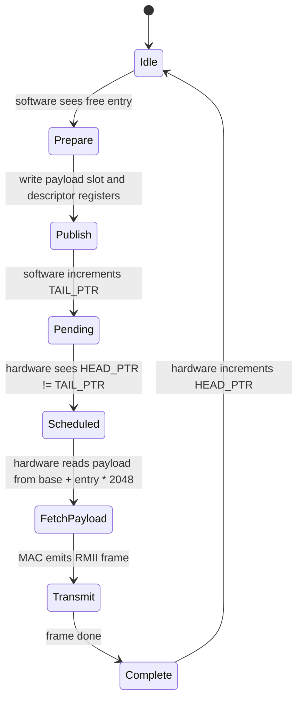

# Ethernet TX Software Interface

This page describes the software-facing TX register map and the payload memory layout used by the current `eth_tx` implementation.

## Payload Memory Layout

Software provides a base address for the TX payload region using the `PAYLOAD_BASE_ADDR` register. The TX hardware treats this region as four fixed-size payload slots. Each slot is 2048 bytes wide, although Ethernet payload data is limited to 1500 bytes.



For descriptor entry `N`, the payload address is calculated by hardware as:

```text
payload_address = PAYLOAD_BASE_ADDR + (N * 2048)
```

The descriptor registers do not store a payload pointer per entry. They store only the destination MAC address and payload length. The slot address is derived from the descriptor index.

## Register Map

All registers are 32-bit and word-aligned. Unaligned accesses return an AXI-Lite error response.

### Control / Status Registers

| Offset | Name | Access | Description |
| --- | --- | --- | --- |
| `0x00` | `PAYLOAD_BASE_ADDR` | R/W | Base AXI address of the TX payload memory region. Entry 0 starts at this address. Entry `N` starts at `PAYLOAD_BASE_ADDR + N * 2048`. |
| `0x04` | `TAIL_PTR` | R/W | Software-owned producer pointer. Software increments this after preparing a descriptor and payload slot. Only bits `[1:0]` are used. |
| `0x08` | `HEAD_PTR` | R | Hardware-owned consumer pointer. Hardware increments this after a frame has completed transmission. Only bits `[1:0]` are used. |

### Descriptor Entry Registers

Each descriptor entry has three registers. Entry `N` describes the payload stored in slot `N`.

| Entry | Register Range | Payload Slot Address |
| --- | --- | --- |
| Entry 0 | `0x10` - `0x18` | `PAYLOAD_BASE_ADDR + 0x0000` |
| Entry 1 | `0x20` - `0x28` | `PAYLOAD_BASE_ADDR + 0x0800` |
| Entry 2 | `0x30` - `0x38` | `PAYLOAD_BASE_ADDR + 0x1000` |
| Entry 3 | `0x40` - `0x48` | `PAYLOAD_BASE_ADDR + 0x1800` |

| Offset | Name | Access | Description |
| --- | --- | --- | --- |
| `0x10` | `ENTRY0_DEST_MAC_LOW` | R/W | Destination MAC address bits `[31:0]`. These are transmitted as the first four destination MAC bytes. |
| `0x14` | `ENTRY0_DEST_MAC_HIGH` | R/W | Destination MAC address bits `[47:32]` in bits `[15:0]`. Bits `[31:16]` are unused. |
| `0x18` | `ENTRY0_PAYLOAD_LENGTH` | R/W | Payload length in bytes. Valid range is 1 to 1500. |
| `0x20` | `ENTRY1_DEST_MAC_LOW` | R/W | Destination MAC address bits `[31:0]` for entry 1. |
| `0x24` | `ENTRY1_DEST_MAC_HIGH` | R/W | Destination MAC address bits `[47:32]` for entry 1 in bits `[15:0]`. |
| `0x28` | `ENTRY1_PAYLOAD_LENGTH` | R/W | Payload length in bytes for entry 1. |
| `0x30` | `ENTRY2_DEST_MAC_LOW` | R/W | Destination MAC address bits `[31:0]` for entry 2. |
| `0x34` | `ENTRY2_DEST_MAC_HIGH` | R/W | Destination MAC address bits `[47:32]` for entry 2 in bits `[15:0]`. |
| `0x38` | `ENTRY2_PAYLOAD_LENGTH` | R/W | Payload length in bytes for entry 2. |
| `0x40` | `ENTRY3_DEST_MAC_LOW` | R/W | Destination MAC address bits `[31:0]` for entry 3. |
| `0x44` | `ENTRY3_DEST_MAC_HIGH` | R/W | Destination MAC address bits `[47:32]` for entry 3 in bits `[15:0]`. |
| `0x48` | `ENTRY3_PAYLOAD_LENGTH` | R/W | Payload length in bytes for entry 3. |

## Head / Tail Operation

The TX descriptor table is a four-entry ring. Software owns the tail pointer. Hardware owns the head pointer.



### Software Producer Flow

1. Read `HEAD_PTR` and `TAIL_PTR`.
2. If advancing `TAIL_PTR` would equal `HEAD_PTR`, the ring is full and software must wait.
3. Use the current `TAIL_PTR` value as the descriptor index.
4. Write the payload into that entry's payload slot:

```text
payload_slot_address = PAYLOAD_BASE_ADDR + (TAIL_PTR * 2048)
```

5. Write the descriptor registers for that entry:
   - destination MAC low
   - destination MAC high
   - payload length
6. Publish the descriptor by writing the next tail pointer value to `TAIL_PTR`.

### Hardware Consumer Flow

1. Hardware compares its internal schedule pointer against `TAIL_PTR`.
2. If they differ, at least one descriptor is pending.
3. Hardware reserves FIFO space and writes the destination MAC into the TX FIFO.
4. Hardware reads payload bytes from:

```text
PAYLOAD_BASE_ADDR + (entry_index * 2048)
```

5. The RMII MAC transmits the Ethernet frame.
6. When transmission completes, hardware increments `HEAD_PTR`.

### Pointer Meaning

| Condition | Meaning |
| --- | --- |
| `HEAD_PTR == TAIL_PTR` | Ring is empty. No frames are pending. |
| `next(TAIL_PTR) == HEAD_PTR` | Ring is full. Software must not publish another frame yet. |
| `HEAD_PTR != TAIL_PTR` | At least one frame is pending or in progress. |

`HEAD_PTR` and `TAIL_PTR` are 2-bit pointers, so they wrap naturally from `3` back to `0`.

