# RMII Ethernet System Block Diagram

```mermaid
flowchart LR
    PHY["RMII PHY<br/>50 MHz ref_clk<br/>RXD[1:0], CRS_DV, RXER<br/>TXD[1:0], TX_EN"]

    subgraph RXCLK["RMII RX Clock Domain"]
        RXMAC["rmii_mac_rx<br/>preamble/SFD detect<br/>destination MAC filter<br/>CRC/FCS check"]
    end

    subgraph RXCDC["RX Clock Domain Crossing"]
        RXFIFO["xpm_fifo_async<br/>10-bit entries<br/>status[9:8] + byte[7:0]"]
    end

    subgraph AXI["AXI / System Clock Domain"]
        RXDMA["eth_rx_dma"]
        RXCOL["dma_payload_collector<br/>removes status words<br/>builds 16-byte chunks"]
        RXBUF["ping-pong chunk buffer<br/>2 x 16 bytes"]
        RXWR["dma_axi_writer<br/>AXI4 write master"]
        RXSTAT["dma_status_manager<br/>RX base address<br/>head/tail publication"]

        TXSTAT["tx_status_manager<br/>TX descriptors<br/>head/tail scheduling"]
        TXRD["tx_axi_reader<br/>AXI4 read master"]
        TXFIFOW["tx_fifo_manager<br/>dest MAC insertion<br/>payload FIFO writer"]
    end

    subgraph MEM["External AXI Memory"]
        RXMEM["RX payload region<br/>written by eth_rx"]
        TXMEM["TX payload region<br/>read by eth_tx<br/>4 slots x 2048 bytes"]
    end

    subgraph TXCDC["TX Clock Domain Crossing"]
        TXFIFO["xpm_fifo_async<br/>35-bit entries<br/>last + valid bytes + data[31:0]"]
    end

    subgraph TXCLK["RMII TX Clock Domain"]
        TXFIFOR["tx_fifo_manager<br/>frame start/finish handshake"]
        TXMAC["tx_rmii_mac<br/>preamble/SFD<br/>source MAC + eth type<br/>padding + FCS"]
    end

    CPU["Software / Testbench<br/>AXI-Lite control"]

    PHY -- "RX RMII" --> RXMAC
    RXMAC -- "payload bytes + frame status" --> RXFIFO
    RXFIFO --> RXCOL
    RXCOL --> RXBUF
    RXBUF --> RXWR
    RXSTAT -- "write base address" --> RXWR
    RXWR -- "AXI4 writes" --> RXMEM
    RXWR -- "frame done" --> RXSTAT

    CPU -- "AXI-Lite RX regs" --> RXSTAT
    CPU -- "AXI-Lite TX regs" --> TXSTAT
    CPU -- "writes TX payload slots" --> TXMEM

    TXSTAT -- "payload addr + length" --> TXRD
    TXSTAT -- "dest MAC schedule" --> TXFIFOW
    TXRD -- "AXI4 reads" --> TXMEM
    TXMEM -- "read data" --> TXRD
    TXRD -- "payload FIFO entries" --> TXFIFOW
    TXFIFOW --> TXFIFO
    TXFIFO --> TXFIFOR
    TXFIFOR -- "FIFO stream" --> TXMAC
    TXFIFOR <-- "start/finish toggles" --> TXMAC
    TXMAC -- "TX RMII" --> PHY

    classDef phy fill:#111827,stroke:#111827,color:#ffffff
    classDef rmii fill:#eafaf1,stroke:#2f9e44,color:#0b2e13
    classDef cdc fill:#fff8e5,stroke:#c27c0e,color:#3b2700
    classDef axi fill:#f7f1ff,stroke:#805ad5,color:#24103f
    classDef mem fill:#eef6ff,stroke:#4b7bec,color:#102a43
    classDef cpu fill:#f1f5f9,stroke:#64748b,color:#0f172a

    class PHY phy
    class RXMAC,TXMAC,TXFIFOR rmii
    class RXFIFO,TXFIFO cdc
    class RXDMA,RXCOL,RXBUF,RXWR,RXSTAT,TXSTAT,TXRD,TXFIFOW axi
    class RXMEM,TXMEM mem
    class CPU cpu
```

## Flow Summary

| Direction | Path |
| --- | --- |
| RX | RMII PHY -> `rmii_mac_rx` -> async FIFO -> RX DMA -> AXI memory |
| TX | AXI memory -> TX AXI reader -> async FIFO -> `tx_rmii_mac` -> RMII PHY |
| Control | Software configures RX and TX through AXI-Lite register blocks |

